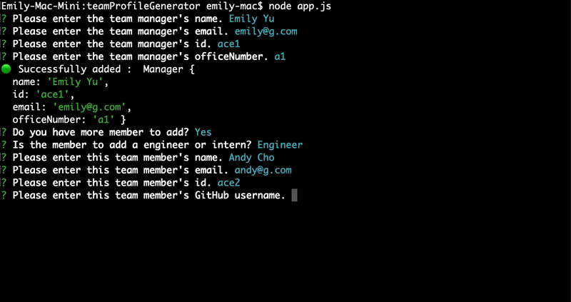

# Team Profile Generator

> Quick and easy Node CLI generating a software engineering team profile

## 🎯 Purpose

As a team member or manager, you can simply create a team profile including all members' basic info so that you can easily access to their emails and GitHub profiles.

## ❓How to use

1. Open the app and run it by `node app.js`.
2. Answer to the prompt questioning about a manager.
3. If you have more member to add, type `y` or `yes` to the question about additional member.

## 🧩 Feature

- It supports following role types: Manager, Engineer, Intern
- Info to enter: name, role, id, email, office number(manager), GitHub(engineer), school(intern)
- You can check the example of completed HTML file in `output` folder.

## ✨ Demo

